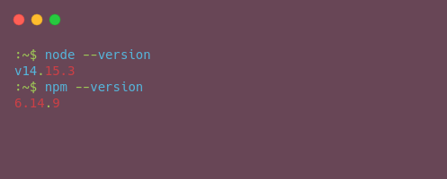
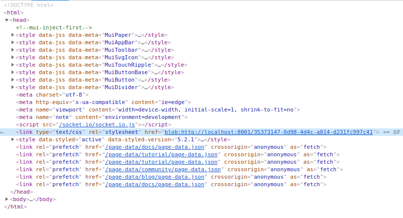

for a quick preview visit  [this link](https://reactjs-clone.netlify.app/)

#### requirements, envirenement setup

to be able to follow a along side with this tutorial make sur to have the following installed.

1. nodejs (npm)
2. git 
3. gatsby CLI

our main focus is to build faster web Apps UIs using React UI libraries, so we're escaping the **Development Environment Set Up**, and redirects you to [this amazing tutorial](https://www.gatsbyjs.com/docs/tutorial/part-zero/) from the official gatsby site.

if you have already installed and configured this tools lets quick check our versions before we start.

run the following commande from your favorite terminal.

```bash
> node --version
> npm --version
```
The output should look similar to the screenshot below, showing version numbers in response to the commands.




next install gatsby CLI globaly and init a new gatsby project.

```bash
> npm install -g gatsby-cli
```
after installing the cli, run the following : 

```bash
> gatsby new

This command will generate a new Gatsby site for you in
/whereever-you-choosed with the setup you select. Let's answer some questions:

What would you like to call your site?
✔ · My Gatsby Site
What would you like to name the folder where your site will be created?
✔ pp/ my-gatsby-site
? Will you be using a CMS?
(Single choice) Arrow keys to move, enter to confirm
· No (or I'll add it later)
? Would you like to install a styling system?
· styled-components
? Would you like to install additional features with other plugins?
(Multiple choice) Use arrow keys to move, enter to select,
and choose "Done" to confirm your choices
 ◯ Add the Google Analytics tracking script
 ◯ Add responsive images
 ◯ Add page meta tags with React Helmet
 ◯ Add an automatic sitemap
 ◯ Enable offline functionality
 ◯ Generate a manifest file
 ◉ Add Markdown support (without MDX)
 ◯ Add Markdown and MDX support
  ─────
```

The CLI will run an interactive shell asking for the above options before creating a Gatsby site for you.

make sure to select styled-components for styling system?,  Add Markdown support (without MDX) for additional features.

after the installation finishes open the file(whereever you named the project) with a text editor, mine is [VSCode](https://code.visualstudio.com/), also i recomande using it, because its free and open source, and it contain a lot of features(Extensions).

Inside your Gatsby project, you will see somthing like the screenshot below.for more details about the role of each file and folder check the [official gatsby docs](https://www.gatsbyjs.com/docs/reference/gatsby-project-structure/#files).


back to your command line, add react-bootstrap and Material-Ui libraries by installing the following npm packages

```bash
> npm install react-bootstrap bootstrap
> npm install @material-ui/core
> npm install @material-ui/icons
> npm install gatsby-plugin-material-ui
```

>Note the last dependency is the gatsby-plugin-material-ui, this plugin will help us to override the default styling by injecting the material-ui styles first.

The Gatsby Config File:

in the root of your project note the gatsby-config.js file, 
this file let us configure the gatsby [plugins](https://www.gatsbyjs.com/plugins/) to add functionality 
and customize our Gatsby apps, in our case we need to override the
[material-ui](https://material-ui.com/) styles to applie our own, lets see how it works.

navigate to the gatsby.config.js file and update the plugins array, to match the following: 


```javascript
module.exports = {
  siteMetadata: {
    title: "My Gatsby Site",
  },
  plugins: [
    "gatsby-plugin-styled-components",
    "gatsby-transformer-remark",
    {
      resolve: `gatsby-plugin-material-ui`,
      options: {
        stylesProvider: {
          injectFirst: true,
          },
      },
    },
    {
      resolve: "gatsby-source-filesystem",
      options: {
        name: "pages",
        path: "./src/pages/",
      },
      __key: "pages",
    },
  ],
};
```
That's all for the material-ui library, next we need to configure react-bootstrap this time we'll use another gatsby file.

The Gatsby browser File:

depends on the version of gatsby you installed it may or may not contain the gatsby-browser.js, if not add this file to the root of your project.

copy past the following code and save.

```javascript
import 'bootstrap/dist/css/bootstrap.min.css';
```
This file gives us the abilty to interacte with the client-side of Gatsby. in our case we just made bootstrap styles available globally in our project.

if you want to verfiy the that the styls are properly imported in the head of the html documment opne the browser devtools and inspect the head tag  you will a diffrent link and style links the bootsrap style that we imported are highlated in the the screenshot bellow:



> notice that at the top of the head tag we have this <!--mui-inject-first--> followed by some style tags, thos are comming from the material-ui styles remember how we configured the library to inject its styles first, at this stage you'll not get any styles tags because we didn't import any MUI component yet, this is what we'll do next

Creating our first Component:

in create a components folder inside the src folder, we will put all our components inside of this folder in the src/components create a new file layout.js.

copy and past the following code to src/components/layout.js

```javascript
import React from 'react'
import {
    Container
} from 'react-bootstrap'
import PrimarySearchAppBar from './app-bar'
import Footer from './footer'

import { createGlobalStyle } from 'styled-components'

const GlobalStyle = createGlobalStyle`
body,html {
    margin:0;
    padding:0;
    font-family: -apple-system, BlinkMacSystemFont,
                 Segoe UI, Roboto,Oxygen,
                 Ubuntu,Cantarell,
                 Fira Sans,Droid Sans,
                 Helvetica Neue,sans-serif;
    font-weight: 400;
}
h1,h2,h3{
    color: #61dafb;
}
`

const Layout = ({ children }) => {
    return (
        <React.Fragment>
            <GlobalStyle />
            <Container fluid className="px-0">
                <PrimarySearchAppBar />
                <Container fluid className="px-0 pt-5">
                    {children}
                </Container>
                <Footer />
            </Container>
        </React.Fragment>
    )
}

export default Layout
```
if you save and run the gatsby develop command nothing will happens, because we are not using this component any where in our pages.

open the index.js file from src/pages/ folder and update  it to mathch the following

```javascript
import * as React from "react"
import Layout from '../components/layout'

const IndexPage = () => {
  return (
    <Layout>
    </Layout>
  )
}
export default IndexPage
```
the role of this component is to wrapp the pages with the same shared layout.

try to run the gatsby develop command again and you'll get the following error

```bash
  32:18  error  'PrimarySearchAppBar' is not defined  react/jsx-no-undef
  36:18  error  'Footer' is not defined               react/jsx-no-undef

✖ 2 problems (2 errors, 0 warnings)


File: src/components/layout.js

failed Building development bundle - 17.015s
```

that because we didn't defined thos two components yet, back to the src/components file and create app-bar.js file and copy past the following code.

```js
import React from 'react';

import AppBar from '@material-ui/core/AppBar';
import Toolbar from '@material-ui/core/Toolbar';
import TranslateIcon from '@material-ui/icons/Translate';
import LaunchIcon from '@material-ui/icons/Launch';
import {
  Row,
  Col
} from 'react-bootstrap'
import { Link } from 'gatsby';

export default function PrimarySearchAppBar() {

  return (
    <AppBar position="fixed" className="app-bar px-lg-5">
        <Toolbar className="toolbar">
            <Row className="align-items-center justify-content-center flex-grow-1">
                <Col xs={1} md={2} className="d-flex justify-content-start">
                    <Link to={`/`} className="d-flex react-logo">
                        
                        <span>
                            React
                        </span>
                    </Link>
                </Col>
                <Col xs={7} md={4} className="d-flex align-items-center justify-content-lg-end">
                    <Link to={`/docs`} className="link-bsb px-2 px-lg-3" >
                        Docs
                        </Link>
                    <Link to={`/tutorial`} className="link-bsb px-2 px-lg-3" >
                        Tutorial
                        </Link>
                    <Link to={`/blog`} className="link-bsb px-2 px-lg-3" >
                        Blog
                        </Link>
                    <Link to={`/community`} className="link-bsb px-2 px-lg-3" >
                        Community
                    </Link>
                </Col>
                <Col xs={2} lg={3} className="d-flex align-items-center justify-content-end">
                    <input
                        className="ml-4"
                        placeholder='Search'
                    />
                </Col>
                <Col xs={1} md={3} lg={3} className="d-flex align-items-center justify-content-center">
                    <Link to={`/docs`} className="link-asb mx-md-2">
                        v17.0.1
                    </Link>}
                    <Link to={`/tutorial`} className="link-asb mx-md-2">
                        <TranslateIcon className="mx-md-2" />
                        <span>
                            Languages
                        </span>
                    </Link>
                    <a href="https://github.com/facebook/react/" className="link-asb mx-md-2">
                      GitHub
                      <LaunchIcon
                        fontSize="inherit"
                        className="mx-1 text-secondary"/>
                    </a>
                </Col>
            </Row>
        </Toolbar>
    </AppBar>
  )
}
```
in the code above, first we import the material-ui AppBar and Toolbar components that will construct our main app-bar component, next we import react-bootsrap `Row` and `Col` components to layout the app-bar elements,

> the material-ui library also provide components such as Grid and Container to build responsive layout but the purpose of this tutorial is to mix  react-bootstrap with material-ui


notice how we're using bootstrap classes into the `<AppBar>` this work just fine because material-ui styles are injected first, this is great because we can import any material-ui component and applie bootstrap classes to it.

remember that we added styled-components to our styling system chois when first created a new gatsby site, we will use it to add styles to look just like the [reactjs](https://reactjs.org/) website.

update the app-bar.js component by adding the following

```js
...
import styled from 'styled-components'
const AppBarStyles = styled.div`
    .app-bar{
        background:#20232a;
    }
    .react-logo{
        color: #61dafb;
        &:hover{
            text-decoration:none;
        }
        &:focus{
            color:#fff;
        }
        span{
            color: inherit;
            margin-left: 10px;
            font-weight: 700;
            font-size: 20px;
            line-height: 20px;
        }
    }
    .link-bsb{
        color:#fff;
        font-weight: 300;
        height:64px;
        min-height:56px;
        display:flex;
        align-items:center;
        &:hover{
            text-decoration: none;
            color: #61dafb;
        }
        &:focus{
            outline: 0;
            background-color: #373940;
            color: #ffffff;
        }
    }
    .link-asb{
        color:#fff;
        font-weight: 300;
        display:flex;
        font-size:14px;
        align-items:center;
        &:hover{
            text-decoration: none;
            color: #61dafb;
        }
        &:focus{
            outline: 0;
            background-color: #373940;
            color: #ffffff;
            border-radius: 15px;
        }
    }
    .search-bar{
        width: 16px;
        background: transparent;
        border: 0;
        color: #ffffff;
        font-size: 18px;
        font-weight: 300;
        font-family: inherit;
        padding: 4px 4px 4px 29px;
        background-image: url('/img/search.svg');
        background-size: 16px 16px;
        background-repeat: no-repeat;
        background-position-y: center;
        background-position-x: 4px;
        transition: width 0.2s ease, padding 0.2s ease;
    }
    .search-bar:focus{
        outline: 0;
        background-color: #373940;
        border-radius: 0.25rem;
        width:8rem;
    }

`
export default function PrimarySearchAppBar() { ...

```
next wrapp the entire `<AppBar>` with `<AppBarStyles>` to applie the styles.

```javascript
<AppBarStyles>
  <AppBar>
   ...
  </AppBar>
</AppBarStyles>
```
now import the useMediaQuery built in hook from @material-ui/core/useMediaQuery that we will use to add responsive behaviour and toggle some components on spesific breakpoint.

update the code by adding the following 

```javascript
...
const breakpoints = {
    sm: "576px",
    md: "768px",
    lg: "992px",
    xl: "1200px",
}
export default function PrimarySearchAppBar() {  
    const md = useMediaQuery(`(min-width: ${breakpoints.md})`);
    const lg = useMediaQuery(`(min-width: ${breakpoints.lg})`);
...
```
the hook return a boolean true/false depends on the media query you pass to it, in this case we stick to react-bootstrap media queries.

update the file again to add responsive behaviour on the md and lg breakpoint 

```javascript
<AppBarStyles>
  <AppBar position="fixed" className="app-bar px-lg-5">
      <Toolbar className="toolbar">
          <Row className="align-items-center justify-content-center flex-grow-1">
              <Col xs={1} md={2} className="d-flex justify-content-start">
                  <Link to={`/`} className="d-flex react-logo">
                      
                      {md &&
                          <span>
                              React
                          </span>
                      }
                  </Link>
              </Col>
              <Col xs={7} md={4} className="d-flex align-items-center justify-content-lg-end">
                  <Link to={`/docs`} className="link-bsb px-2 px-lg-3" >
                      Docs
                      </Link>
                  <Link to={`/tutorial`} className="link-bsb px-2 px-lg-3" >
                      Tutorial
                      </Link>
                  <Link to={`/blog`} className="link-bsb px-2 px-lg-3" >
                      Blog
                      </Link>
                  <Link to={`/community`} className="link-bsb px-2 px-lg-3" >
                      Community
                  </Link>
              </Col>
              <Col xs={2} lg={3} className="d-flex align-items-center justify-content-end">
                  <input
                      className="search-bar ml-4"
                      placeholder='Search'
                      style={{
                          width: lg && "100%",
                      }}
                  />
              </Col>
              <Col xs={1} md={3} lg={3} className="d-flex align-items-center justify-content-center">
                  {md && <Link to={`/docs`} className="link-asb mx-md-2">
                      v17.0.1
                      </Link>}
                  <Link to={`/tutorial`} className="link-asb mx-md-2">
                      <TranslateIcon className="mx-md-2" />
                      {md && <span>
                          Languages
                      </span>}
                  </Link>
                  {lg && <a href="https://github.com/facebook/react/" className="link-asb mx-md-2">
                      GitHub
                      <LaunchIcon
                          fontSize="inherit"
                          className="mx-1 text-secondary" />
                  </a>}
              </Col>
          </Row>
      </Toolbar>
  </AppBar>
</AppBarStyles>
```

the way we're using the breakpoints is to tell react to render a component if the media-query is true, the case of the Github link, or to applie styles in this case the `<input>` width property.

> Note the search-bar class in the `background-image` property we're giving a path to search.svg file that doesn't exist yet , create a file name it static download and put  the icon in the static/img/ gatsby will automaticaly make the files in this folder available as static assets

next lets add the footer component.

